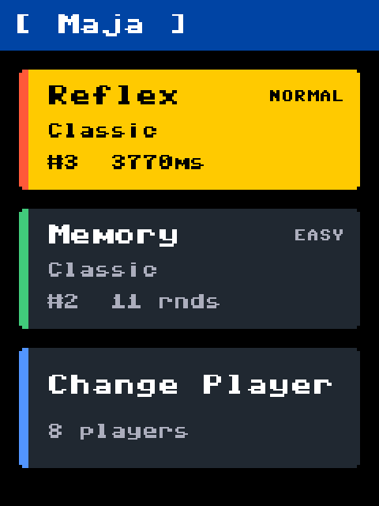
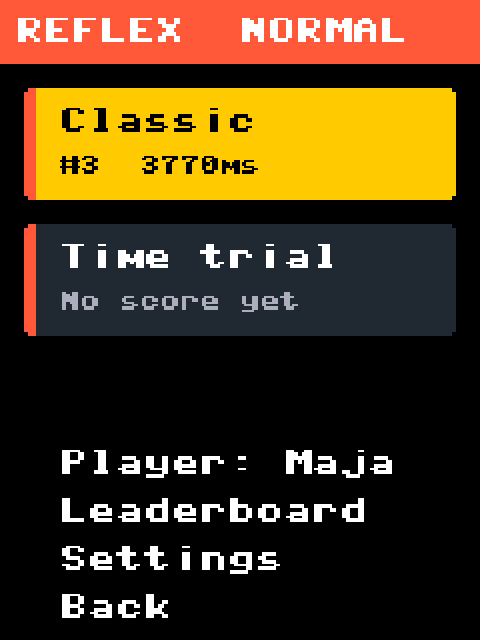
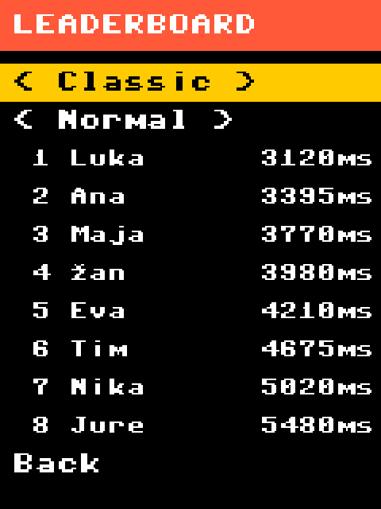
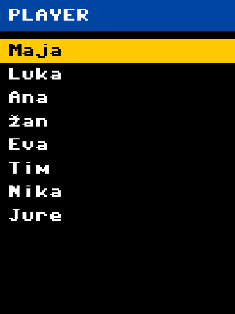
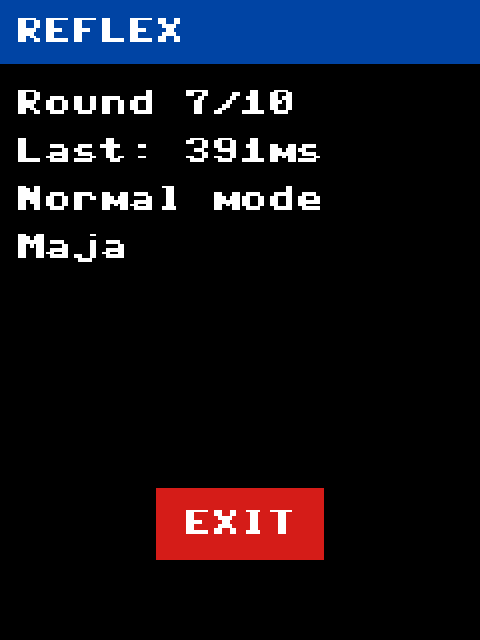
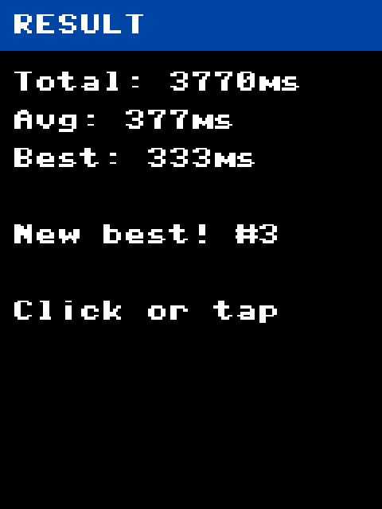
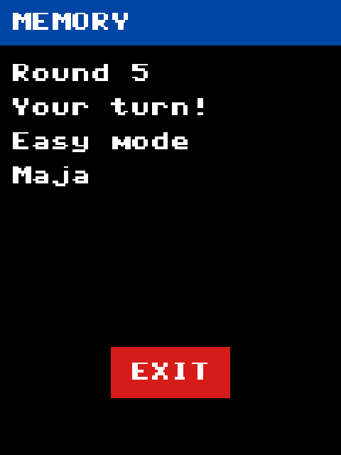

# Pico Arcade

A small arcade machine built on a Raspberry Pi Pico 2 W: five light-up buttons, a 2.8" touch screen and a rotary knob. It has two games, a leaderboard for each, and remembers every player's best score.

## Features

- **Reflex**: buttons light up and you hit them as fast as you can. Ten rounds, with 1, 2 or 3 buttons at once depending on the difficulty.
- **Memory**: a Simon Says game. Repeat a growing sequence of lights until you make a mistake. Higher difficulties play the sequence faster.
- **Leaderboards** for every game and difficulty, with one entry per player (their personal best).
- **Players**: pick who's playing from a list of names. Scores and settings survive power-off.
- **Knob or touch**: navigate the menus with the rotary knob, or tap and drag on the screen.

## Screenshots

<p>
  
  
  
  
</p>
<p>
  
  
  
</p>

## What you need

- Raspberry Pi Pico 2 W (the WH version has headers already soldered)
- 2.8" ILI9341 SPI display (240×320) with XPT2046 touch
- 5 push buttons with LEDs
- KY-040 rotary encoder
- Micro-USB cable and jumper wires

## Wiring

**Buttons and LEDs**

| Button | LED pin | Button pin |
|---|---|---|
| 1 | GPIO13 | GPIO12 |
| 2 | GPIO15 | GPIO14 |
| 3 | GPIO17 | GPIO16 |
| 4 | GPIO19 | GPIO18 |
| 5 | GPIO21 | GPIO20 |

**Rotary encoder**

| Encoder | Pico |
|---|---|
| CLK | GPIO5 |
| DT | GPIO6 |
| SW | GPIO7 |
| + | 3V3(OUT) |
| GND | GND |

**Display**

| Display | Pico |
|---|---|
| CS | GPIO0 |
| RESET | GPIO1 |
| SCK | GPIO2 |
| SDI (MOSI) | GPIO3 |
| DC | GPIO4 |
| VCC, LED | 3V3(OUT) |
| GND | GND |
| SDO (MISO) | not connected |

**Touch (same display board)**

| Touch | Pico |
|---|---|
| T_CLK | GPIO10 |
| T_CS | GPIO9 |
| T_DIN | GPIO11 |
| T_DO | GPIO8 |
| T_IRQ | GPIO22 |

## Installation

1. **Flash MicroPython.** Download the latest [Pico 2 W firmware](https://micropython.org/download/RPI_PICO2_W/). Hold the **BOOTSEL** button while plugging the Pico into USB. It shows up as a drive; drag the `.uf2` file onto it and the board restarts.
2. **Install the upload tool** on your computer:

   ```powershell
   py -m pip install -r requirements-dev.txt
   ```

   On macOS or Linux, use `python3` instead of `py`.
3. **Copy the game onto the Pico:**

   ```powershell
   .\deploy.ps1
   ```

   On macOS or Linux: `mpremote fs cp *.py players.txt : + reset`

   The game now starts whenever the Pico is powered on. Running the command again only copies changed files and never touches saved scores or settings. If the board isn't found, use `.\deploy.ps1 -Port COM7` with your port, and close any other program using the Pico (such as the MicroPico extension in VS Code).

## How to play

Turn the knob to move and press it to select, or tap the screen. The main menu shows one card per game with your best score, plus **Change Player**.

Picking a game opens its screen with the game's modes, the current player, **Leaderboard**, **Settings** (difficulty, and wait time for Reflex) and **Back**. Each game currently has a **Classic** mode; the other modes are placeholders.

While a game is running, tap the red **Exit** button to quit. Nothing is saved from a game you exit.

### Touch screen

The first time the game starts, it asks you to tap three crosses so it knows where the screen is. To redo this later, hold the knob down while powering on, then let go.

The screen is pressure-sensitive rather than like a phone's, so a fingernail or stylus works best.

### Players

Player names come from `players.txt`, one per line. Edit it on your computer and copy it to the Pico:

```powershell
py -m mpremote fs cp players.txt :
```

No restart is needed. Removing a name keeps that player's scores on the leaderboards.

### Resetting

- Clear all scores: `py -m mpremote fs rm :scores.json`
- Reset settings (including touch calibration): `py -m mpremote fs rm :settings.json`

Restart the Pico afterwards.

## Development

To run the game without installing it, copy the files once with `deploy.ps1`, then:

```powershell
py -m mpremote run main.py
```

The menus are also printed to the USB serial output, which helps with debugging. `py -m mpremote` opens a Python prompt on the Pico (Ctrl-] to leave).

To add a game mode, write a function that plays one game and returns `(score, result_title, result_lines)`, then add it to the `MODES` list at the end of `reflex.py` or `memory.py`:

```python
Mode("timeattack", "Time attack", run_time_attack, lambda n: f"{n} hits", higher_is_better=True),
```

The menus and leaderboards pick it up automatically. For the Exit button to work, call `display.draw_exit_button()` after drawing the game screen, use `ui.wait_ms()` for pauses, and call `ui.check_exit()` in loops that wait for a button.

The screenshots above are rendered on your computer, no Pico needed: `py tools/render_screens.py` runs the real game code with a simulated screen, buttons and player, using sample names and scores, and writes `docs/images/`. Run it again after changing how a screen looks.
